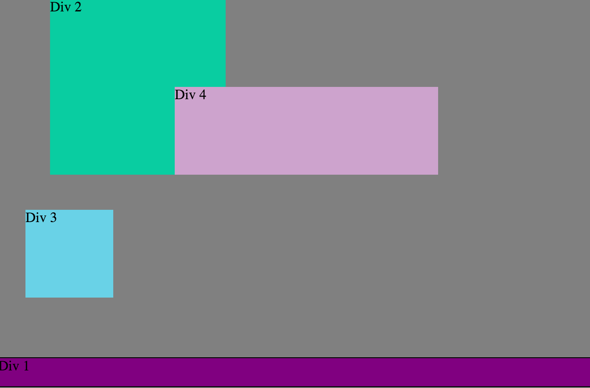

#How can you use Chrome's DevTools inspector to help you format or position elements?
We can use the DevTools inspector to see exactly what the code is doing and make modifications to it in real time to see how things will move with out actually messing with the real code. We can then move things around and make sure we know what to put in the real code before we implement the idea.

#How can you resize elements on the DOM using CSS?
We can go to the elements side and change what we want accordingly because they already have a CSS file setup for us. We just make the changes that we want and boom there it is on the page. 

#What are the differences between absolute, fixed, static, and relative positioning? Which did you find easiest to use? Which was most difficult? Static: is the default position for an element so whatever the element would have normally done that is what is will do. Relative: lets you set the element to a postition relative to it's starting position. If I left the attributes for Relative alone it would be like static, but if I were to add top: 3px; then it would move down 3 pixes relative to its starting position. Absolute: This will allow you to place an element anywhere you want on the page regardless of what any other element is doing. Fixed: places an element somewhere and it is glued to the screen and it wont move while scrolling up or down. No matter what it will always stay.

#What are the differences between margin, border, and padding?
Pretend we have a box on our screen with the word "easy" in it. Now, margin is how far that box is from the edge of the screen. If I want to move my box right I need to have a margin on the left so it pushes it right. It's a little counterintuitive, but if you think about it for a second it works. For border, pretend we have the boxes outline and its, lets say, red; that is the border. If we want to make the border larger we need to expand it by pixels like this - border: 2px;. this will make the border of our box larger and easier to see. Now for the padding - this moves our word "easy" around in the box. I can move it up, down, left, right all over the place, but it will always be in the box and our border. Think of these three elements as margin being the big picture, border is outlining the the content and padding is moving the content around inside that border.  

#What was your impression of this challenge overall? (love, hate, and why?)

My impression was that it was really fun. I had a good time with my partner moving elements around and seeing what everything does. We both learned a little about borders and padding, I believe.